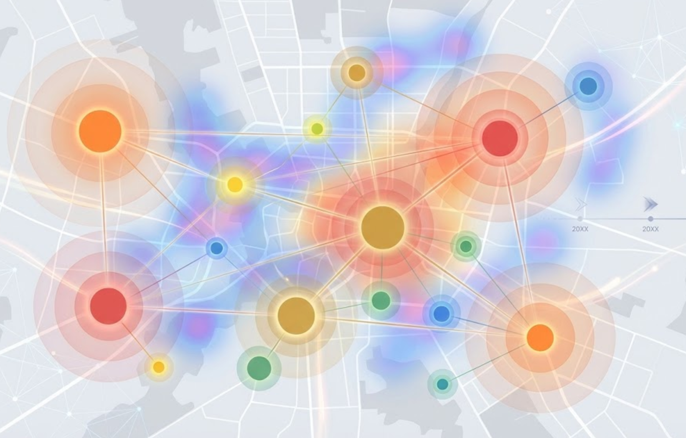

## Overview

A data-driven framework to understand how heterogeneous **online–offline (virtual–physical) consumption demand** reshapes the hierarchy, boundaries, and catchments of urban commercial centres over time, and to support early warning of demand–supply mismatch.

## Why this matters
Rapid digital transformation is changing how residents access goods and services, creating new demand patterns that may challenge the resilience and efficiency of traditional commercial centres. This project studies the evolving spatial structure of commercial centres and the mechanisms behind it, with an emphasis on interpretable, scalable modelling for planning and policy support.

## Key research questions
- How do different socio-economic groups differ in their **online vs. offline** consumption needs and frequencies?
- How do shifts in “virtual–physical” demand drive changes in commercial-centre spatial structure, including **nonlinear threshold effects** and **time-lagged responses**?

## Technical approach
1. **Demand identification (virtual–physical):** infer heterogeneous demand using a combination of survey-derived behavioural signals and large-scale mobility/activity proxies; model choice behaviour with a hybrid of classical choice modelling and deep learning for nonlinearity.
2. **Commercial-centre extraction & characterization:** delineate centre boundaries via density-based clustering; reveal internal organisation using network community detection; derive centre hierarchy and influence/catchment measures.
3. **Mechanism modelling:** explain and predict spatial-structure evolution with interpretable machine learning and time-series diagnostics to detect **thresholds** and **lags** in demand–structure coupling.
4. **Early warning & scenario simulation:** simulate future demand trajectories and flag locations where demand–supply mismatch is likely to emerge or worsen; translate findings into planning-oriented optimisation suggestions.

## Keywords
urban commercial centres; spatial structure; digital consumption; online–offline interaction; spatio-temporal modelling; interpretable machine learning; planning support

