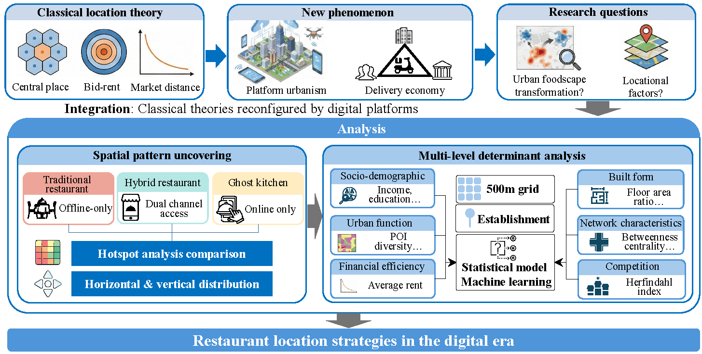

## Citation

```bibtex
@article{deng2026digital,
  title={Digital visibility, physical obscurity: Uncovering the location strategies of ghost kitchens in platform urbanism},
  author={Deng, Weipeng and Tang, Yihong and Liu, Yaxin and Yang, Tianren},
  journal={Under Review},
  year={2026},
  keywords={Digital-physical nexus;Urban foodscape;Platform urbanism;Planning support systems;Machine learning}
}
```
---

## Abstract

Digitalization and platform economies are transforming the restaurant sector, giving rise to "ghost kitchens." These delivery-only operations remain physically obscure yet digitally prominent. Their hidden nature creates new forms of spatial ambiguity and raises challenges for regulatory oversight. This study maps the spatial distribution of ghost kitchens in urban environments, identifies their clustering patterns, analyzes their location strategies, and compares them with traditional and hybrid restaurant models. Our findings reveal distinct spatial patterns of ghost kitchens in areas with relatively "weak" commercial locations, challenging the conventional wisdom that physical visibility is essential for restaurant success. By examining locational drivers at both horizontal (neighborhood function and street network proximity) and vertical (floor level and building characteristics) scales, we reveal a delivery-oriented siting logic that trades storefront exposure for access and efficiency, extending restaurant location theory to platform-mediated services. For practice, the findings guide retailers, platforms, and public agencies by identifying where ghost kitchens are most likely to emerge and which built-environment attributes shape their siting, thereby supporting evidence-based policies and governance that balance innovation with consumer protection, food safety, and public health.



## Keywords

- Digital-physical nexus
- Urban foodscape
- Platform urbanism
- Planning support systems
- Machine learning

---
**Links:**
* [Read more about this article (Coming soon)](#)
* [The link to the online version (Coming soon)](#)
