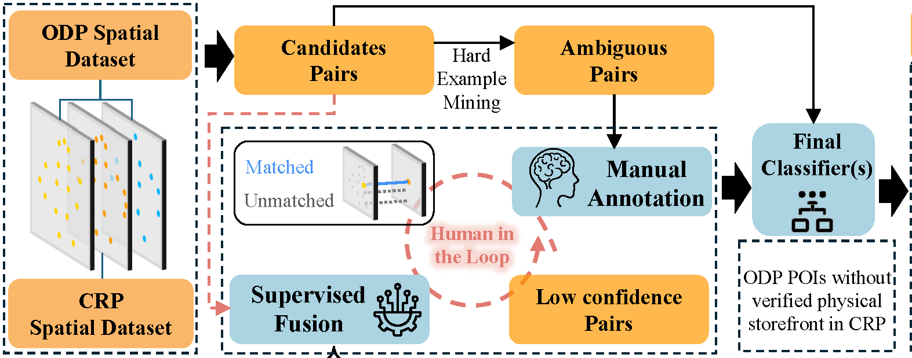

## Abstract

The proliferation of ghost kitchens (i.e., delivery-only restaurants without physical storefronts) poses significant challenges for urban food system monitoring and regulatory oversight. These establishments maintain digital visibility on delivery platforms while eluding visibility in the physical public realm, creating information asymmetries that compromise transparency and consumer protection. This work presents LLM4GKID, a comprehensive approach for detecting ghost kitchens by leveraging the sensing capability of large language models to match Point of Interest records across platforms. The methodology integrates multiple information sources through a staged pipeline: geographic filtering to identify spatial candidates, language model-based semantic similarity assessment, visual consistency analysis of establishment imagery, and machine learning classification. Central to our contribution is the alignment failure detection mechanism, which systematically identifies delivery-only establishments lacking corresponding entries in crowdsourced review databases. Evaluation on a manually annotated dataset of restaurant POI pairs from Shenzhen, China, demonstrates substantial performance improvements over existing methods adapted for our task. The progressive filtering strategy significantly reduces computational complexity while maintaining high recall by conservatively selecting candidates. Our framework addresses fundamental challenges in category-specific business model detection, where traditional POI conflation approaches fail due to sparse category features and the spatial autocorrelation implied by Tobler's law. LLM4GKID overcomes these limitations through the integration of multimodal evidence and negative matching logic, enabling the accurate identification of establishments with asymmetric digital presence patterns. The framework allows downstream research in food access equity, regulatory compliance monitoring, and broader applications to other business models with asymmetric digital footprints.

