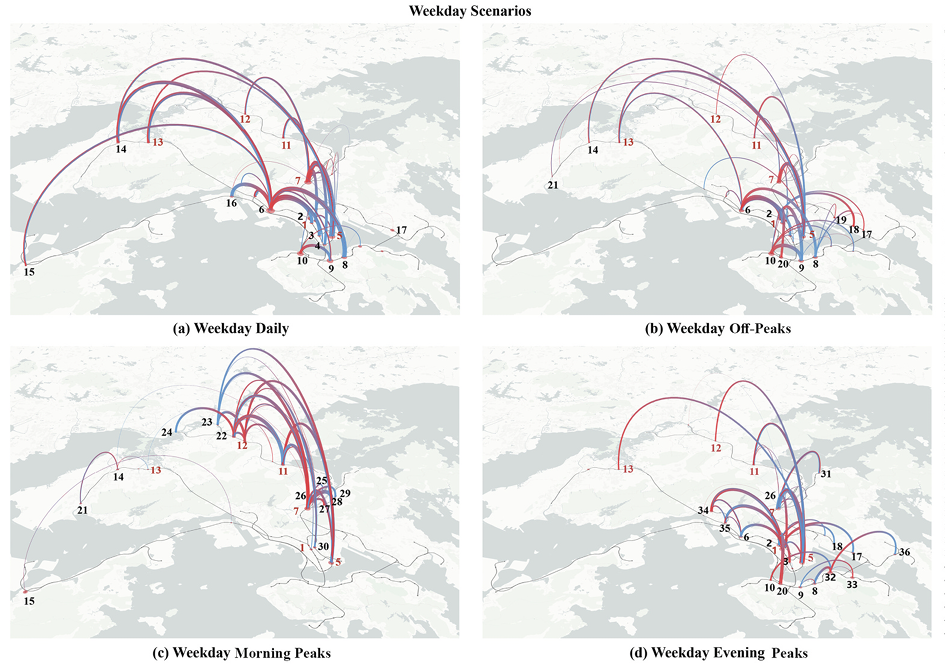

## Citation

```bibtex
@article{lei2026evaluating,
  title={Evaluating age-friendly public transportation: a novel smart card data approach analyzing travel time differences between older and younger travelers after controlling for confounding effects},
  author={Lei, Shuyu and Zhou, Mingzhi and Deng, Weipeng and Tang, Yihong and Zhou, Jiangping},
  journal={Transportation Research Part A: Policy and Practice},
  volume={204},
  pages={104842},
  year={2026},
  publisher={Elsevier}
}
```
---

## Abstract

Age-friendly public transportation systems have gained increasing prominence in public policy discourse. However, the conceptualization and assessment of 'age-friendliness' remain underdeveloped. To address this gap, we propose a novel framework for the evaluation of age-friendliness in metro systems, which utilizes the widely available smart card data in the public transportation sector. Using travel time differences (TTD) as a proxy measure for age-friendliness at the station and station-pair levels, we analyzed disparities between older and younger adult metro users in Hong Kong. After controlling for system familiarity via k-means clustering into frequency subclusters (frequent, moderate, and infrequent) and for temporal variations, we identified significant TTD disparities, especially during weekday morning peaks. Using a scoring system to pinpoint consistently problematic stations and high-impact routes for older adults, we identified geographic clusters of high-TTD locations around major interchange hubs and peripheral stations. Multivariate analysis of variance further demonstrated that environmental configurations, interchange complexity, and travel frequency significantly influence TTD. Notably, stations with high structural complexity consistently exhibited greater TTD despite high levels of effort-reducing pedestrian facilities provision. These effects are particularly pronounced among moderate and infrequent travelers during morning peaks and off-peak periods. In conclusion, our study presents a scalable, data-driven approach for identifying priority locations for targeted age-friendly improvements in metro systems.



---
**Links:**
* [Read more about this article](https://doi.org/10.1016/j.tra.2025.104842)