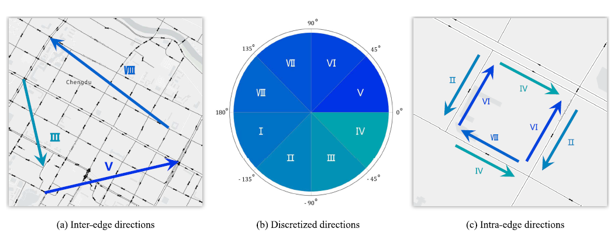

## Citation

```bibtex
@article{tang2025routekg,
  title={Routekg: A knowledge graph-based framework for route prediction on road networks},
  author={Tang, Yihong and Zhao, Zhan and Deng, Weipeng and Lei, Shuyu and Liang, Yuebing and Ma, Zhenliang},
  journal={IEEE Transactions on Intelligent Transportation Systems},
  year={2025},
  publisher={IEEE}
}
```
---

## Abstract

Short-term route prediction on road networks allows us to anticipate the future trajectories of road users, enabling various applications ranging from dynamic tra c control to personalized navigation. Despite recent advances in this area, existing methods focus primarily on learning sequential transition patterns, neglecting the inherent spatial relations in road networks that can a ect human routing decisions. To fill this gap, this paper introduces RouteKG, a novel Knowledge Graph-based framework for route prediction. Specifically, we construct a Knowledge Graph on the road network to encode spatial relations, especially moving directions that are crucial for human navigation. Moreover, an n-ary tree-based algorithm is introduced to e ciently generate top-K routes in batch mode, enhancing computational efficiency. To further optimize prediction performance, a rank refinement module is incorporated to fine-tune candidate route rankings. The model performance is evaluated using two real world vehicle trajectory datasets from two Chinese cities under various practical scenarios. The results demonstrate a significant improvement in accuracy over the baseline methods. We further validate the proposed method by utilizing the pre-trained model as a simulator for real-time tra c flow estimation at the link level. RouteKG has great potential to transform vehicle navigation, traffic management, and a variety of intelligent transportation tasks, playing a crucial role in advancing the core foundation of intelligent and connected urban systems. 

